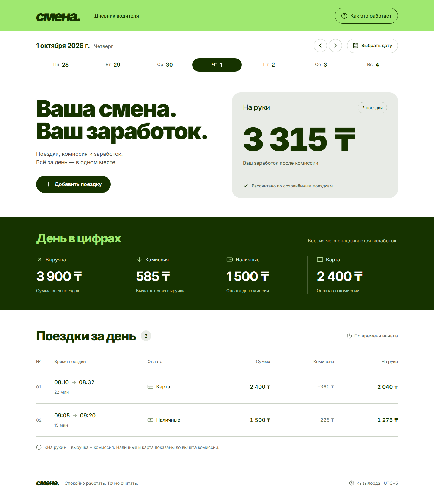
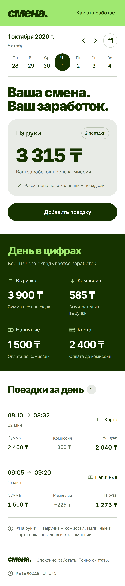

# Смена

**Время деньги. Берегите оба.** Дневник водителя: выберите дату, посмотрите поездки и заработок после комиссии, добавьте новую поездку. Мини-проект по тестовому заданию arqa.

[Публичный репозиторий](https://github.com/naimaaan/smena-driver-diary)



<details>
<summary>Экран телефона</summary>



</details>

## Возможности и режимы

- Выбор дня через неделю, стрелки, календарь и кнопку «Сегодня»; дата сохраняется в адресе страницы.
- Сводка: число поездок, выручка, комиссия, наличные, карта и «на руки»; список с итогами за день.
- Добавление поездки, проверка данных, защита от повторной отправки, состояния пустого дня и ошибки.
- Адаптивный интерфейс, закреплённая кнопка добавления и пояснения к расчётам по значку ⓘ.

| Режим | Данные и сохранение |
|---|---|
| Локально / Docker | Полноценный Fastify API и постоянная база SQLite |
| Vercel | Статическое демо: начальные поездки из `data/trips.json`, добавленные — в `localStorage` этого браузера |

В демо работают переключение дней, форма и расчёты. Серверного API в нём нет; в подвале показана отметка **«Демо · данные хранятся в этом браузере»**. API из задания доступен при локальном запуске и в Docker.

Стек: **React, Vite 7, TypeScript, Tailwind CSS 4, Fastify 5**, встроенный модуль Node.js `node:sqlite`. Общие правила валидации и расчётов используются сервером и демо.

## Локальный запуск

Нужны **Node.js 22, начиная с 22.17**, и npm. Версия указана в `.nvmrc`.

```bash
git clone https://github.com/naimaaan/smena-driver-diary.git
cd smena-driver-diary
npm ci
npm run dev
```

Откройте [http://localhost:5173](http://localhost:5173). Vite передаёт запросы `/api` серверу на порту `3000`.

По умолчанию открыт **1 октября 2026 года**: 2 поездки, выручка **3 900 ₸**, комиссия **585 ₸**, наличные **1 500 ₸**, карта **2 400 ₸**, на руки **3 315 ₸**. Есть данные соседних дней; день без поездок показывает нули.

### Производственная сборка

```bash
npm run build
npm start
```

Откройте [http://localhost:3000](http://localhost:3000). Один сервер отдаёт API и собранный интерфейс.

### Docker

```bash
docker compose up --build
```

Откройте [http://localhost:8080](http://localhost:8080). SQLite хранится в volume `smena-data`; перезапуск контейнера и `docker compose down` сохраняют поездки.

### Настройки локального сервера

Настройка окружения не обязательна. При необходимости скопируйте [`.env.example`](.env.example) в `.env`: `PORT` и `HOST` задают адрес сервера, `DATABASE_PATH` — путь к SQLite (по умолчанию `data/smena.sqlite`), `SEED_FILE` — исходный JSON (по умолчанию `data/trips.json`).

При первом запуске начальные поездки и маркер импорта записываются в одной транзакции. Последующие запуски не добавляют их повторно и не перезаписывают пользовательские поездки.

## Демо на Vercel

1. В Vercel выберите **Add New → Project** и импортируйте GitHub-репозиторий.
2. Оставьте корень проекта без изменений, Framework Preset — **Vite**, Node.js — **22.x**.
3. Настройки из [`vercel.json`](vercel.json) применятся автоматически: установка `npm ci`, сборка `npm run build:demo`, Output Directory `dist/client`.
4. Нажмите **Deploy**. Отдельная база данных и переменные окружения не нужны.

`build:demo` собирает Vite с `--mode demo`. Для просмотра той же сборки локально:

```bash
npm run build:demo
npm run preview:demo
```

Откройте [http://127.0.0.1:4173](http://127.0.0.1:4173). Добавленные поездки сохраняются после обновления страницы в том же браузере и на том же домене. Другой посетитель получает собственные данные.

## API локального приложения

API принимает и возвращает JSON. В разработке базовый адрес — `http://localhost:3000`, в Docker — `http://localhost:8080`.

| Запрос | Результат |
|---|---|
| `GET /api/days/2026-10-01` | `{ date, timeZone, trips, summary }`; сводка содержит `tripCount`, `revenue`, `commission`, `net`, `cash`, `card` |
| `POST /api/trips` | Добавление поездки с валидацией и защитой от дублей |
| `GET /api/health` | `{ "status": "ok" }` |

Пример тела `POST /api/trips`:

```json
{
  "id": "demo-request-001",
  "start": "2026-10-01T10:00:00+05:00",
  "end": "2026-10-01T10:25:00+05:00",
  "amount": 2000,
  "payment": "cash",
  "commission": 300
}
```

Новый `id` возвращает `201` и `{ trip, created: true }`. Повтор того же `id` с теми же нормализованными данными — `200` и `created: false`; с другими данными — `409`. Некорректный запрос — `400`. Клиент создаёт ID до отправки и сохраняет при повторе; для новой поездки нужен новый ID. Разные ID считаются разными поездками. В SQLite уникальность `id` защищает и от одновременных повторов.

Сумма — целое число от `1` до `1 000 000 000` тенге; комиссия — целая сумма от `0` до суммы поездки; оплата — `cash` или `card`. Время — полный ISO 8601 с секундами и явным часовым поясом (`Z` или `±HH:mm`); окончание строго позже начала. Проверяются реальные календарные даты. Контракты: [`shared/types.ts`](shared/types.ts).

День определяется по началу поездки в фиксированном **UTC+05:00 (`Asia/Qyzylorda`)**, независимо от часового пояса устройства. Поездка через полночь относится ко дню начала. Выручка — сумма оплат, комиссия — сумма комиссий, **на руки = выручка − комиссия**. Наличные/карта показывают выручку до комиссии. Пустой день возвращает `200`, пустой список и нулевую сводку.

## Проверки

```bash
npm run check
npx playwright install chromium
npm run test:e2e
npm run build:demo
npm run test:demo
```

`check` запускает тесты расчётов, API и демо-хранилища, проверяет TypeScript и собирает локальное приложение. `test:e2e` проверяет локальное приложение в браузере: даты, форму, ошибки, повтор после потери ответа и адаптивность. `test:demo` проверяет статическую сборку: работу без API, сохранение после обновления, изоляцию посетителей и ошибку записи в хранилище. Браузерные проверки сами запускают нужные серверы; порты `3000`, `5173` и `4173` должны быть свободны.

CI настроен в [`.github/workflows/check.yml`](.github/workflows/check.yml): проверки, обе браузерные конфигурации и проверка запуска Docker. Результаты запусков доступны в [Actions](https://github.com/naimaaan/smena-driver-diary/actions).

## Ограничения

- Один водитель, без авторизации, синхронизации между устройствами и интеграций с платёжными системами. «На руки» — расчёт заработка, а не банковский баланс или вывод денег.
- Демо на Vercel хранит добавления только в браузере: очистка данных сайта удалит их, другой браузер или домен их не увидит. Это демонстрация интерфейса; серверная часть сдаётся и проверяется локально / в Docker.
- Для постоянного хранения SQLite нужен сохраняемый диск; Docker Compose использует именованный volume. Черновик формы после перезагрузки страницы не восстанавливается.
